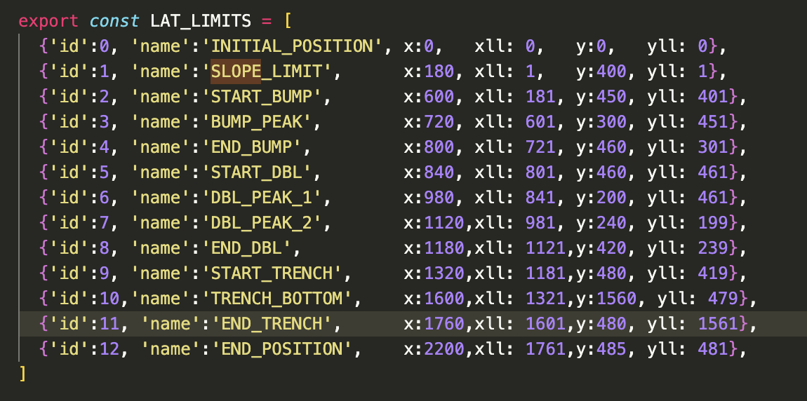

[link to view project](https://dmgudeman.github.io/DiveTheTrieste/)

## Dive The Trieste!
Dive the Trieste! is a app to allow the user to explore
the ocean's depths.  The app opens with a submarine
icon at the surface.  With the use of arrows the submarine
starts its descent. It travels down the depths and the 
sub allows the screen to travel to new and unseen places.
When the user goes to a new depth there is an appropriate
set of pictures showing life at that depth.  The photos
are either of bottom dwellers (benthic) or free swimming
animals (pelagic) depending on where the sub is located.

### The submarine moves on a classic cross section of the ocean
At first the submarine moves across the screen first due the background
moving. At screen, the background stops moving and the state is transferred
to the submarine object which moves ontop the background
to the edge. The difficult job of maintaining state and creating a smooth
transition was  accomplished by updating coordinates on both the submarine 
as well as the background. Dynamic calculation
of the depth allows the sub to avoid crashing into the bottom. The bottom
was first mapped with lateral constants. 

Storing objects were stored in an
array to allowed the use of array methods. The y coordinate of the ocean
floor was  calculated using the classic y intercept method.

### Flora and Fauna are shown from different areas of ocean
The submarine position in ocean is used to filter subsets of images
showing life at that depth.One of six arrays of images is chosen by depth and
proximity to shore. Then a random image is presented to the
submarine viewport.

### Hand drawn sprite
A controversial area for some people. I like the animated hand drawn quality of
it and chose this over a polished sprite taken from the internet.  I did indeed 
draw this myself one evening. 

### Music
The built in music is a critical aspect to enjoy the user experience.

### Project Architecture
This project changes between three 'pages'. This is due to utilization 
of three seperate canvases that are layered by eventlisteners on buttons. This 
architecture allowed allowed me to explore the challenges of CSS in placing
elements and conditionally showing them.

### Technologies, Libararies, APIS
Canvas API to render the diagram
Webpack and Babel to bundle and transpile the Javascript code
npm to manage dependencies
font-awesome for the github and linkedIn icons

