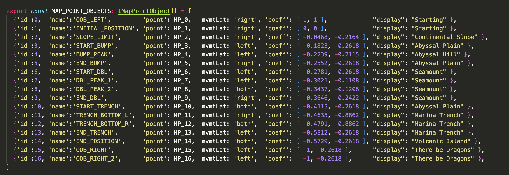
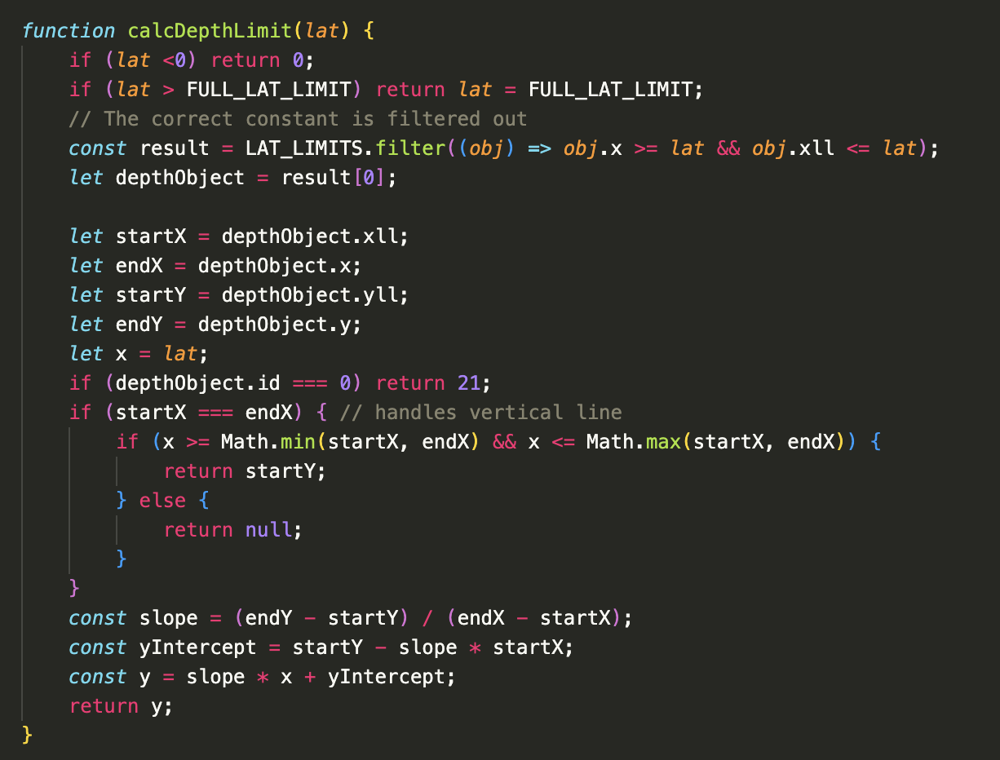

[link to view project](https://dmgudeman.github.io/DiveTheTrieste/)

    &nbsp;
    &nbsp;
    &nbsp;
    &nbsp;

<!--  -->

## Dive The Trieste!
Dive the Trieste! is an educational app to allow the user to explore
the ocean's depths. It is evocative of the historic, 1960,  bathyscape
dive into the Mariana Trench.  The app opens with a submarine
icon at the surface.  With the use of arrows the submarine
starts its descent. It travels down the depths and the 
sub allows the screen to travel to new and unseen places.
The user can change into the codkpit where images of the
appropriate depth and photic zone are shown.  The photos
are either of bottom dwellers (benthic) or free swimming
animals (pelagic) depending on where the sub is located.

### The submarine moves on a classic cross section of the ocean
At first the submarine moves across the screen first due the background
moving. At one point the background stops moving and the state is transferred
to the submarine object which moves on top the background
to the edge. The difficult job of maintaining state and creating a smooth
transition was  accomplished by updating coordinates on both the submarine 
as well as the background object. 

These two objects were constructed as singleton in an attempt to create 
a computed "single location of truth." This proved to be problematic
because, as canvas elements, it was unwieldy to get the current context
to render appropriately.

I then refactored using a Publish Subscribe model with a central event bus to
define the events that are emitted. At first I tried emit events on the main animation
loop. This overwhelmed the computer. Now an event is emitted
every time a coordinate changed. Any area of the app can subscribe to the event,
however I found that defining a singleton class as a single point
of truth to work the best. The position is then obtained from this instance. In building
this app the impetus for Redux became very clear.

The next task was to map out the topography of the ocean floor with hills and
trenches. This was done by take manual measurements of the topograhic endpoints
and using the coordinates to calculate a y intercept for each point of lateral
movement. These were used to make a coefficient that defines the topography by 
points calculated from the viewport width and height. 

The multiple complex data types to allow position calculaton, conditonal styling,
showing textual data based on position on the canvas made keeping track of the 
data types difficult. I implemented Typescript to facilitate solving this issue 
and it proved invaluable. An example type:

Storing objects in an array to allowed the use of array filter method. Points 
are calculated the viewport dimensions. The y coordinate of the ocean
floor is then calculated using the classic y intercept method.

### Images and text are shown from 6 different areas of ocean
The submarine position in ocean is used to filter calulate 2 values: depth and
proximity to the sea floor. One of six arrays of images is filtered then a random 
image is presented to the submarine viewport. A parallel filter picks the appropriate
text.

### Modals provide instruction and user feedback in the cockpit
A popup modal to provide instruction on how to use the app allowed me to add 
educaitonal content to the splash page. I then used the modal class to make
two more modals to give the user feedback in the cockpit as to when they
hit the bottom or are at the surface. 

### Hand drawn sprite
I drew a sprite to explore how sprites work. I liked the animated hand drawn quality of
it so I kept it in the app. It also allowed me to add features such as the "crash sprite" 
that occurs when sub hits ground in an expiditious manner. Plus I enjoyed drawing it :)  

### Music
The built in music is a critical aspect to enjoy the user experience.

### Project Architecture
This project changes between three 'pages'. This is due to utilization 
of three seperate canvases that are layered by eventlisteners on buttons. This 
architecture allowed allowed me to explore the challenges of CSS in placing
elements and conditionally showing them.

### Technologies, Libararies, APIS
Canvas API to render the diagram
Webpack and Babel to bundle and transpile the Typescript code
npm to manage dependencies
font-awesome for the github and linkedIn icons

