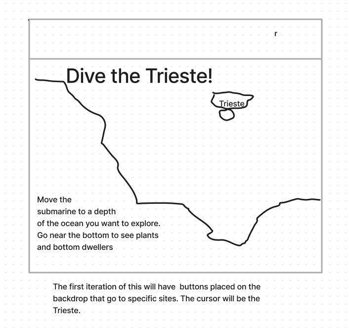
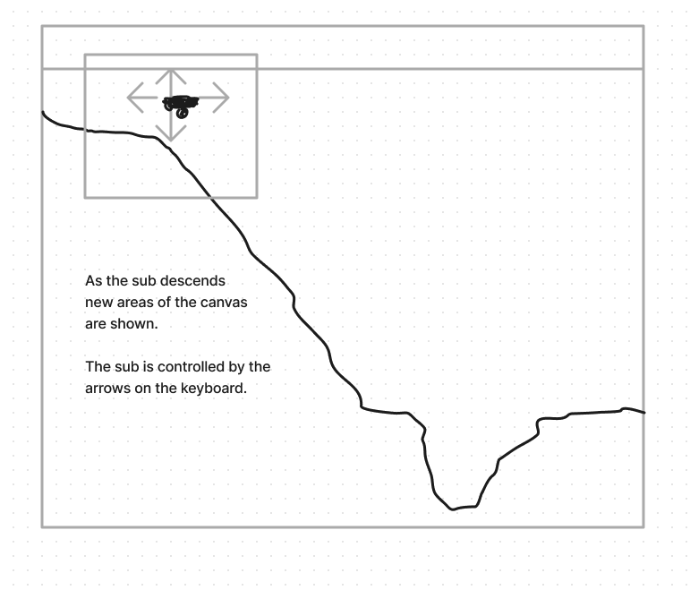
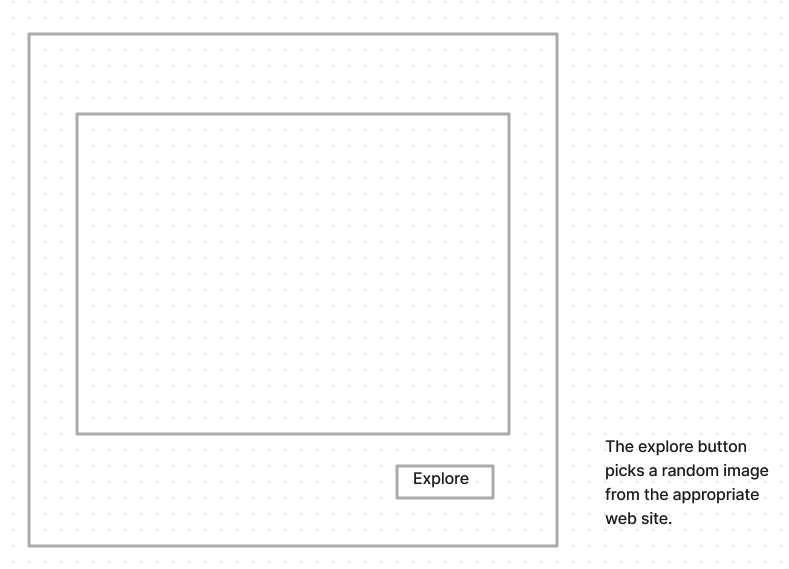

## Dive The Trieste!

Dive the Trieste! is a app to allow the user to explore
the ocean's depths.  The app opens with a submarine
icon at the surface.  With the use of arrows the submarine
starts its descent. It travels down the depths and the 
image allows the screen to travel to new and unseen places.
Along the way there are links to web sites that tell about 
flora and fauna at this depth.

When the sub is about 2/3 of the way down the screen the
screen will re-render to show the lower area of the ocean
and the back drop will continue changing as you descend.

### Functionality & MVPS
In Dive the Trieste!, users will be able to navigate
the subamarine around the ocean depths.
When the submarine(cursor) clicks a site, it will
switch to the cockpit of a submarine with a viewport.
This will show marine life from that area(which is a website).
There will be randomness generated by pressing a button
that will cause the the image/video to reload to a new
presentation of nature at that depth. 

### Technologies, Libararies, APIS
Canvas API to render the diagram 
Webpack and Babel to bundle and transpile the Javascript code
npm to manage dependencies

### Implementation Timeline

Friday Afternoon & Weekend:
Project setup, Styling the opening page with a diagram
in the background and ability to move the sub.  Making the
backgorund update smoothly. Be able to collect
the information from a link to provide to the next view.
Being able to change into the submarine cockpit.

Monday:
Styling the submarine cockpit. Make the viewport
show a website. Becoming familiar with linking to 
website feeds and modifying design to unforseen limitations.
Make a button in the cockpit that adds
randomness to the image you see so that it feels like you
are exploring.

Tuesday: 
Add 5 more sites on the opening page. If I'm ahead at this
point, consider adding a second ocean backdrop with navigation
on a navigation bar.

Wednesday:
Troubleshooting any problems linking to websites. 

Thursday:
Deployment on github

### Bonus features:
I would like to make a back end for this so currated material
could be added with written material and predictable sets of flora
and fauna. Also the user could add their favorites so they could
visit areas that they explored before.

